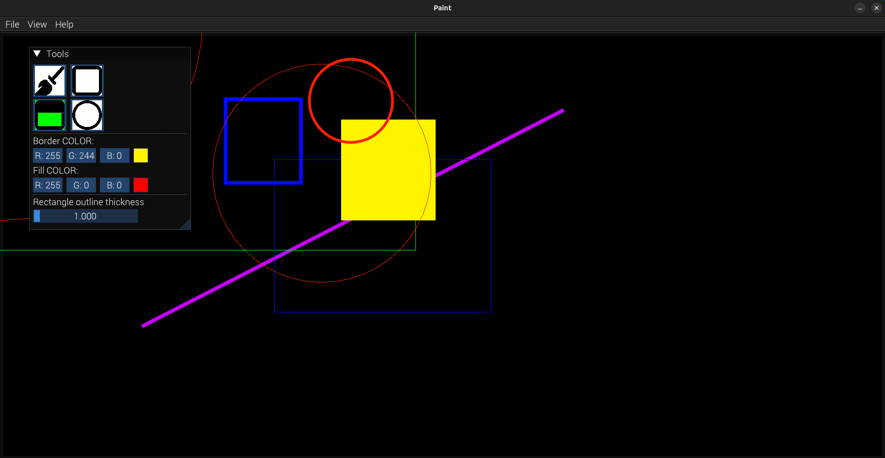
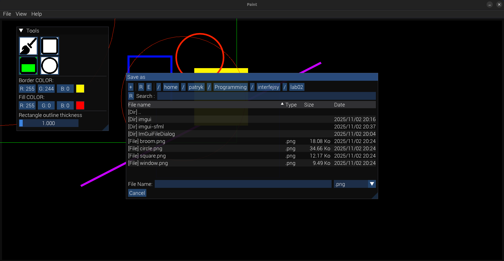
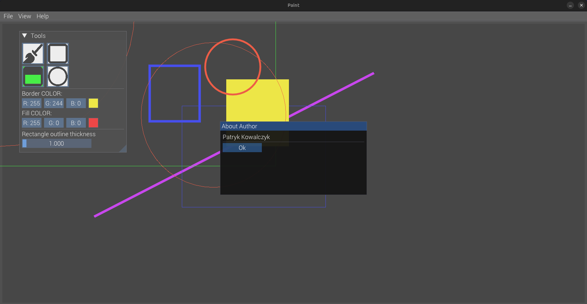

# 🎨 Simple_Paint

Projekt stworzony w C++ z wykorzystaniem **SFML 3.0.2**, **Dear ImGui** oraz **ImGui-SFML**.  
Pozwala na rysowanie prostych kształtów, zmianę kolorów i zapisywanie obrazu — prosty edytor graficzny typu *paint*.

---
## Wygląd i demo działania programu






---

## 🚀 Uruchomienie projektu na Linuxie

### 1️⃣ Zainstaluj wymagane narzędzia i biblioteki systemowe

```bash
sudo apt update

sudo apt install -y build-essential cmake git \
libx11-dev libxrandr-dev libxi-dev libxcursor-dev libudev-dev \
libopenal-dev libflac-dev libvorbis-dev libfreetype-dev libgl1-mesa-dev
````

---

### 2️⃣ Zbuduj SFML 3.0.2 z dynamicznymi bibliotekami `.so`

⚠️ Uwaga: pakiet `libsfml-dev` z `apt` instaluje **wersję 2.6.x**,
a ten projekt wymaga **SFML 3.x**.

```bash
# Przejdź do katalogu projektu (z plikiem main.cpp)
cd ~/Programming/interfejsy/lab02

# Pobierz SFML 3.0.2
git clone --branch 3.0.2 https://github.com/SFML/SFML.git

# Zbuduj i zainstaluj
cd SFML
mkdir build && cd build
cmake .. -DCMAKE_BUILD_TYPE=Release -DBUILD_SHARED_LIBS=ON
make -j$(nproc)
sudo make install

# Zaktualizuj cache linkera
sudo ldconfig
```

---

### 3️⃣ Pobierz potrzebne biblioteki GUI

```bash
# ImGui (interfejs użytkownika)
git clone https://github.com/ocornut/imgui
cd imgui
git checkout v1.89.9
cd ..

# Adapter ImGui-SFML (łączenie ImGui z SFML)
git clone https://github.com/SFML/imgui-sfml
cd imgui-sfml
git checkout master
cd ..

# Okno dialogowe do wyboru plików
git clone https://github.com/aiekick/ImGuiFileDialog
```

---

### 4️⃣ Poprawka w kodzie `imgui-sfml`

W pliku `imgui-sfml/imgui-SFML.cpp` należy zakomentować linię **956**, aby uniknąć błędu podczas kompilacji.

```bash
nano +956 imgui-sfml/imgui-SFML.cpp
```
---

### 6️⃣ Kompilacja projektu

```bash
g++ -std=c++17 -O2 \
main.cpp \
imgui/imgui.cpp \
imgui/imgui_draw.cpp \
imgui/imgui_tables.cpp \
imgui/imgui_widgets.cpp \
imgui-sfml/imgui-SFML.cpp \
ImGuiFileDialog/ImGuiFileDialog.cpp \
-Iimgui -Iimgui-sfml -IImGuiFileDialog \
-lsfml-graphics -lsfml-window -lsfml-system -lsfml-audio \
-lGL \
-o lab02
```

---

### 7️⃣ Uruchomienie

```bash
./lab02
```

---

## 💡 Ideas for Further Development:

🧭 Undo/Redo functionality — allow reverting and reapplying recent actions.

🧹 Clear canvas on "New" button — automatically clear the workspace when creating a new file.

🎨 Live gradient preview — currently, two-color lines are saved with gradients, but the live preview is missing.

🧱 Drawing order fix — ensure that newly added elements appear on top (layered correctly).

🧩 Polymorphic shape system — implement inheritance for shapes (e.g., base Shape class) and store them in a single vector.

🔺 Add more shapes — support for triangles, ellipses, polygons, stars, etc.

🖱️ Shape interaction — enable selecting, moving, resizing, and deleting shapes.

🔤 Text tool — allow adding text elements to the canvas.

---


## 🧾 Licencja

Projekt udostępniony na licencji [MIT](https://opensource.org/licenses/MIT).

